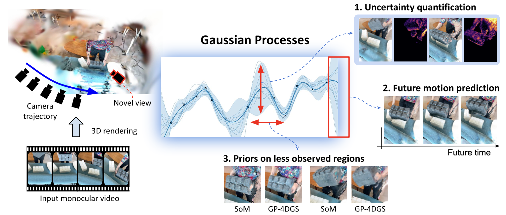

# GP-4DGS: Probabilistic 4D Gaussian Splatting from Monocular Video via Variational Gaussian Processes 

<div align="center">

[Mijeong Kim](https://mjmjeong.github.io/)<sup>1</sup>, [Jungtaek Kim](https://jungtaek.github.io/)<sup>2</sup>, [Bohyung Han](https://cv.snu.ac.kr/index.php/bhhan/)<sup>1</sup>

<sup>1</sup>ECE & IPAI, Seoul National University, Korea &nbsp;&nbsp; <sup>2</sup>University of Wisconsin–Madison, USA

[](https://arxiv.org/abs/2604.02915)
[](https://github.com/mjmjeong/gp4dgs)

</div>

---

## 📌 Overview

> **TL;DR:** We integrate **Gaussian Processes (GPs)** into 4D Gaussian Splatting to enable principled probabilistic modeling of dynamic scenes — bringing uncertainty quantification, future motion prediction, and unobserved region estimation to 4DGS for the first time.

While existing 4DGS methods focus on deterministic reconstruction, they are inherently limited in capturing motion ambiguity and lack mechanisms to assess prediction reliability. GP-4DGS addresses this with three novel capabilities:

- **🎯 Uncertainty Quantification** — identifies regions of high motion ambiguity via GP variance maps
- **🚀 Future Motion Prediction** — forecasts motion beyond training frames using a periodic temporal kernel
- **🌍Unobserved Region Prior** — propagates motion from well-observed to sparse or occluded primitives
- 


## 📢 Updates

- [x] Release the paper on arXiv
- [ ] Release gp module
- [ ] Release full training (SoM & MoSca)

## 🔧 Method

### 1. Composite Spatio-temporal Kernel
We sum a **spatial Matérn kernel** — capturing geometric smoothness among nearby primitives — with a **per-axis periodic temporal kernel** for cyclic motion patterns. Matérn is chosen over RBF to handle discontinuities between spatially separate objects, enabling more faithful modeling of real-world dynamics.

### 2. Variational Inference with Inducing Points
Exact GP inference is `O(N³)`, intractable for tens of thousands of primitives. We use **M inducing points** (M ≪ N) initialized via Chronos-based trajectory clustering, reducing complexity to `O(NM² + M³)` during training and `O(M)` per query at inference time:

```
f(x) ~ GP(m(x), k(x, x'))
q(u) = N(m_u, S_u)    [variational posterior over inducing points]
```
### 3. Uncertainty Quantification
The GP posterior variance provides a principled uncertainty estimate for each primitive's motion. High-variance regions correspond to motion-ambiguous areas (e.g., occlusion boundaries, fast-moving objects):
 
```
Var[f(x*)] = k(x*, x*) - K(x*, u) [K(u, u) + σ²I]⁻¹ K(u, x*)
```
Uncertainty maps are computed per-primitive and can be rendered as pixel-level confidence overlays.
 
### 4. Future Motion Prediction
Beyond observed frames, GP-4DGS extrapolates motion by querying the GP posterior at unseen timestamps. The periodic temporal kernel enables accurate forecasting of cyclic motions:
 
```
μ[f(t*)] = K(t*, u) [K(u, u) + σ²I]⁻¹ u    [posterior mean at future time t*]
```
  
---

## 💳 Citation

```bibtex
@inproceedings{kim2026gp4dgs,
  author    = {Kim, Mijeong and Kim, Jungtaek and Han, Bohyung},
  title     = {GP-4DGS: Probabilistic 4D Gaussian Splatting from Monocular Video via Variational Gaussian Processes},
  booktitle = {CVPR},
  year      = {2026}
}
```
